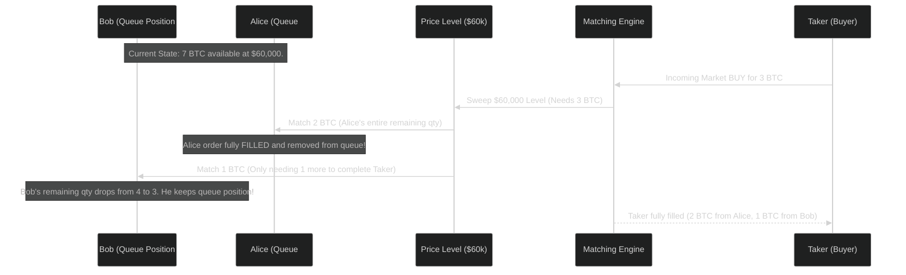

Welcome back! In [Part 1](/post/pyvenue-part-1), we established the deterministic foundation of our exchange engine: integer quantities (`Qty`) to prevent fractional drift, strict `Price` allocations to ensure clean ticks, and strongly typed identifiers that distinguish `Assets` from `Instruments`.

Now, what actually happens when tens of thousands of users place buy and sell orders onto a venue at the same millisecond? How does the matching engine organize, sort, and evaluate who gets to trade with whom, and at what matched price?

To solve this problem, modern financial exchanges use a high-performance data structure known as the **Limit Order Book** (LOB).

## The Core Concept: Bids and Asks

At its most fundamental level, an order book is simply a two-sided marketplace structure. It is divided down the middle into two opposing halves:

1.  **Bids (Buy Orders)**: Buyers want to buy as cheaply as possible. They are willing to pay *up to* their limit price, but preferably less. Therefore, the highest Bid represents the most aggressive buyer and sits at the "top" of the bid side of the book.
2.  **Asks (Sell Orders)**: Sellers want to sell for the highest price possible. They are willing to receive *at least* their limit price, but preferably more. Therefore, the lowest Ask represents the most aggressive seller and sits at the "top" of the ask side of the book.

When the highest Bid price is lower than the lowest Ask price (e.g., Best Bid = `$59,990`, Best Ask = `$60,000`), the market is *at rest*. No immediate trades can occur because buyers are unwilling to pay the prices sellers are asking.

This price difference between the Best Bid and the Best Ask is a market metric known as the **Spread**. A "tight" spread indicates high liquidity and active market maker participation; a "wide" spread suggests volatility, uncertainty, or a less liquid market.

```mermaid
%%{init: {'theme': 'dark', 'themeVariables': { 'primaryColor': '#1e1e1e', 'primaryTextColor': '#fff', 'primaryBorderColor': '#333'}}}%%
graph LR
    subgraph Limit Order Book Overview
        subgraph Sellers
            A3("Ask @ $60,020 (5 BTC)")
            A2("Ask @ $60,010 (2 BTC)")
            A1("Ask @ $60,000 (10 BTC) <br/> [Best Ask]")

            A3 --- A2 --- A1
        end

        subgraph The Spread
            Spread(["Market Spread: $10.00"])
        end

        subgraph Buyers
            B1("Bid @ $59,990 (3 BTC) <br/> [Best Bid]")
            B2("Bid @ $59,950 (15 BTC)")
            B3("Bid @ $59,000 (100 BTC)")

            B1 --- B2 --- B3
        end

        A1 -.-> Spread -.-> B1
    end

    classDef ask fill:#4d2222,stroke:#ff5555,stroke-width:2px;
    classDef bid fill:#224d22,stroke:#55ff55,stroke-width:2px;
    classDef spread fill:#333,stroke:#fff,stroke-width:1px;

    class A1,A2,A3 ask;
    class B1,B2,B3 bid;
    class Spread spread;
```



## Aggregation: The Price Level

In global instruments like `BTC-USD`, it is common for many separate users to place resting limit orders at the same round-number price at roughly the same time (e.g., exactly `$60,000.00`).

If the matching engine had to analyze and sort every one of those individual orders during a live execution sweep, throughput would suffer.

To achieve O(1) or O(log N) sweep speed, the exchange aggregates individual user orders into a `PriceLevel`.

In a high-performance Python architecture, a `PriceLevel` pre-calculates the `total_qty` available at a specific price tick and maintains a strict FIFO (First-In-First-Out) queue of resting individual orders.

```python
from dataclasses import dataclass, field
from .types import Qty, OrderId, RestingOrder

@dataclass(slots=True)
class PriceLevel:
    # 1. We pre-cache the sum of all order quantities here
    total_qty: int = 0

    # 2. We maintain an insertion-ordered dictionary queue
    orders: dict[OrderId, RestingOrder] = field(default_factory=dict)

    def append(self, order: RestingOrder) -> None:
        """Add a newly resting order to the back of the queue."""
        self.orders[order.order_id] = order
        self.total_qty += order.remaining.lots
```

By pre-calculating and updating `total_qty` on the level itself, the engine can execute volume-based sweep logic *without* iterating over every underlying resting order.

**Memory Optimization Note:** In modern Python (3.7+), native `dict` objects preserve insertion order using a dense array-based layout under the hood. For queueing architectures, this is a very useful performance feature. We get to model a real-world FIFO queue while maintaining O(1) ID lookup speeds when we need to cancel an order sitting deep in the middle of a long queue. No need for complex linked list traversal.

## The Golden Rule: Price-Time Priority

Every traditional financial exchange and major crypto venue follows the core rule of trading orchestration: **Price-Time Priority**.

1.  **Price comes first**: The exchange matching engine will *always* execute incoming aggressive orders at the best available price. An incoming Market buyer crossing the spread will move up the Ask side, matching with the lowest available seller first, then moving to the next higher price level only when the previous level is exhausted.
2.  **Time breaks ties**: If multiple users submit orders resting at the same `PriceLevel`, the order that arrived at the matching server *first* (the order at the front of the `dict` queue) gets filled first.

Here is how we define an individual resting order waiting in that `PriceLevel` queue:

```python
@dataclass(frozen=False, slots=True)
class RestingOrder:
    order_id: OrderId
    account_id: AccountId
    instrument: Instrument
    side: Side
    price: Price
    # Remaining starts equal to initial Qty, but degrades as partial matches occur
    remaining: Qty  
```

Notice that `RestingOrder` explicitly tracks a mutable `remaining` quantity instead of a single filled status. An order does not have to fill all at once. If a resting Maker order wants to buy 10 Bitcoin, but an incoming Taker sells only 2 Bitcoin, the Maker's `remaining` balance simply drops to 8 Bitcoin.

Crucially, because this is only a *partial fill*, the Maker's order keeps its temporal position at the front of the `PriceLevel` queue.

### Visualizing Queue Execution Flow

Let's walk through how Price-Time queue execution works during a market sweep. We have three sellers providing liquidity to the Ask order book at exactly $60,000.

1.  **Alice** placed an order to Sell 2 BTC at 10:00:00 AM.
2.  **Bob** placed an order to Sell 4 BTC at 10:00:01 AM.
3.  **Charlie** placed an order to Sell 1 BTC at 10:00:02 AM.

Currently, the `PriceLevel` for $60,000 advertises a combined `total_qty` of `7 BTC` to the public market depth feed.



As shown above, Alice gets rewarded for taking the earliest market risk and receives a complete fill. Bob gets partially filled and retains his queue priority over Charlie for the next incoming sweep.

## Managing Modifiability & Cancellations

But what happens when market conditions change? Sometimes Bob decides $60,000 is too cheap, and he wants to raise his price limit to $61,000 or cancel his resting order entirely.

Canceling a resting LOB order efficiently is an important data structure problem.

If we maintained standard contiguous Array Lists to track Price, removing Bob's order from the middle of a million-order list would cause an O(N) shifting penalty for the rest of the array.

A well-optimized Order Book avoids linear list searches. Instead, it uses indexed dictionary pointer maps that track structural data across multiple dimensions.

```python
from collections import defaultdict

class OrderBook:
    def __init__(self, instrument: Instrument) -> None:
        self.instrument = instrument

        # 1. Global O(1) pointer map tracking every live order
        self.orders_by_id: dict[OrderId, RestingOrder] = {}

        # 2. Aggregations indexing directly by Price tick integer
        self.bids: dict[int, PriceLevel] = defaultdict(PriceLevel)
        self.asks: dict[int, PriceLevel] = defaultdict(PriceLevel)

        # 3. Dedicated active price trackers 
        # (Descending for Bids to find max, Ascending for Asks to find min)
        self.bid_prices: list[int] = []
        self.ask_prices: list[int] = []
```

When Bob sends a `CancelOrder` command, the Engine executes standard O(1) operations:
1.  Grabbing Bob's order pointer from `self.orders_by_id`.
2.  Navigating to the correct `PriceLevel` in `self.asks` using Bob's price index.
3.  Popping the specific dictionary entry directly out of the `PriceLevel.orders` queue map in O(1) time.
4.  Reducing the `PriceLevel.total_qty` by Bob's `remaining` lots at the same time.

### The Role of Market Depth (Level 2 vs Level 3)

The internal design of our `OrderBook` aligns well with how financial trading APIs publish market data streams to algorithmic firms and web frontends.

Most retail platforms render **Level 2 Market Depth**. This data feed ignores individual user orders and simply broadcasts aggregated snapshot updates from the `self.bids` and `self.asks` price level abstractions to the frontend. WebSocket consumers just see "10 BTC available at $60,000"; they do not know whether Alice and Bob make up that 10 BTC volume.

In contrast, institutional quant systems consume **Level 3 Market Depth**, which requires streaming every individual `RestingOrder` creation and cancellation event directly to the consumer. This allows quant firms to simulate and mirror the exact internal `OrderBook` queue priority locally in their own co-located servers.

In [Part 3](/post/pyvenue-part-3), we will move beyond the static state of the order book. We will build the active component that actually sweeps the book and matches Takers into Makers: **The Matching Engine**.

---

Full code can be found under:
https://github.com/cutamar/pyvenue/
