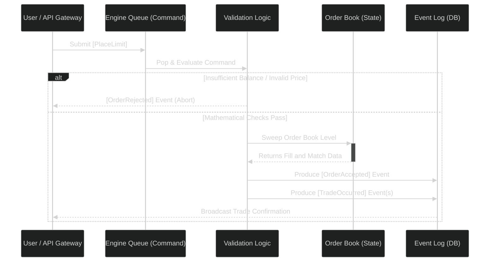

In the previous parts, we defined the deterministic [Data Primitives](./01_domain_primitives.md) and built [The Limit Order Book](./02_limit_order_book.md).

Now, it is time to put everything together to build the component that consumes user requests, evaluates the market, and matches buyers and sellers: **The Matching Engine**.

## Architectural Hierarchy: The Engine and The Venue

Before diving into the core logic of order matching, it is important to understand the architectural hierarchy of a modern financial exchange. Many beginner systems conflate these layers, which leads to scaling bottlenecks.

Our Python architecture is divided into two operational layers:

1.  **The Engine**: A single `Engine` class instance is responsible for managing the state, the ledger, and the limit order book for *exactly one* `Instrument` (e.g., `BTC-USD`). The engine processes every incoming trade for that instrument strictly *serially* (single-threaded) to guarantee determinism.
2.  **The Venue**: The top-level `Venue` class acts as the gateway router. The Venue manages multiple `Engine` instances at the same time. It receives incoming network requests from the API gateway, inspects the requested `Instrument`, and routes the request into the queue of the correct, isolated Engine instance.

Because an Engine manages only a single instrument, an exchange can scale horizontally by spinning up hundreds of isolated Engines on different multi-core servers, increasing aggregate throughput.

## Commands vs. Events: The Core Loop

A trading exchange operates by parsing incoming **Commands** into outgoing authoritative **Events**.

1.  **Commands**: Intentions and requests sent externally by a user (e.g., `PlaceLimit`, `PlaceMarket`, `CancelOrder`).
2.  **Events**: The historical facts produced by the engine that describe exactly what occurred (e.g., `OrderAccepted`, `TradeOccurred`, `OrderCanceled`).

**The Golden Rule:** Because external users can lie (they might request a trade larger than their balance, or they might attempt to spoof or manipulate the market), a Command is inherently untrusted. A command simply sits in a queue until the Engine explicitly unpacks and `handle()`s it. 

Conversely, an Event is authoritative truth. Once an `Event` is generated by the Engine, it cannot fail, be rejected, or be rolled back.

### The Execution Flow



Here is how we declare the standard `Command` structures using lightweight, optimized slots:

```python
from dataclasses import dataclass
from .types import Instrument, AccountId, OrderId, Side, Qty, Price

@dataclass(frozen=True, slots=True)
class Command:
    """Base class for all incoming network intentions."""
    pass

@dataclass(frozen=True, slots=True)
class PlaceLimit(Command):
    instrument: Instrument
    account_id: AccountId
    order_id: OrderId
    side: Side
    qty: Qty
    price: Price
    tif: TimeInForce = TimeInForce.GTC
    post_only: bool = False
```

## Exploring Order Types: Limit vs. Market

Trading exchanges generally offer two primary ways to interact with the order book's liquidity:

1.  **Limit Orders**: You specify the exact `Price` you are willing to pay (or receive) and the maximum `Qty` you want. If the market is not trading at your price, your order rests on the book. By resting, you are providing liquidity to the exchange, making you a **Maker**.
2.  **Market Orders**: You specify only the total `Qty` you want to buy or sell, and you demand it *immediately* at the best available prices resting on the book. You cross the spread, consume passive liquidity, and become a **Taker**.

Because Market orders do not have a price limit, they sweep upward (or downward) through the order book's successive `PriceLevels` until their requested quantity is filled.

If the order book runs out of liquidity before a Market order is fully satisfied, the unfilled quantity is simply canceled.

### Tracing a Match: Partial Fills vs. Full Fills

When multiple orders match against each other, the combinations of partial and full executions are numerous. The Matching Engine handles these combinations automatically.

Imagine Alice has a resting limit order to Sell 1 BTC at $60,000. She is a resting Maker. 

Now Bob wants to buy 3 BTC immediately. He submits a `PlaceMarket` Command.

The engine traces the execution:
1.  **Level 1 Sweep ($60,000)**: The engine searches the lowest Ask level. It finds Alice's resting 1 BTC.
2.  **Match Occurs**: The engine matches Bob and Alice. Since Alice only has 1 BTC, Alice receives a **Full Fill**. Her `remaining` quantity drops to 0, and her order is deleted from the `PriceLevel` queue.
3.  **Bob's Remaining Flow**: Bob wanted 3 BTC, but only found 1 BTC. Bob receives a **Partial Fill**. His internal tracker registers 1 BTC filled, with 2 BTC still remaining.
4.  **Level 2 Sweep ($60,010)**: Because Bob is executing a Market Order, the sequence immediately advances to the next highest available price level to search for the remaining 2 BTC.

## Python Deep Dive: Latency, Determinism, and the GIL

Because we are building a Wall Street-grade matching engine in native Python, we should address the obvious question:

*Can Python actually be fast enough for a high-frequency trading matching engine?* 

Yes. But it requires a different architectural approach from a typical Python service. 

Typically, Python microservices use threading and concurrency (e.g., `asyncio`, `multiprocessing`) to handle web traffic. In an exchange core, however, **concurrency is the enemy of determinism**. 

If three separate operating-system threads attempt to modify Alice's ledger balance or the $60,000 Price Level at the same time, race conditions make the final state unpredictable.

To guarantee sequence integrity, the Engine must process every incoming `Command` sequentially, one at a time. The engine uses an isolated, single-threaded execution loop.

Ironically, Python’s Global Interpreter Lock (GIL) — usually criticized for limiting parallel CPU work — is mostly irrelevant and even somewhat helpful for this architecture. Because the optimal design is a strictly isolated, deterministic single-threaded loop, we simply do not rely on operating system threading. 

By using `dataclass(slots=True)` memory packing, optimized integer calculations, and the compiled C internals behind standard Python structures like `dict`, a single-threaded Python process can sweep tens of thousands of trades per second.

## Advanced Strategies: Time-In-Force (TIF) Logic

When you place a **Limit Order**, exchanges generally require you to attach a Time-In-Force instruction. This dictates how long the order is allowed to stay alive in venue memory. 

Let's look at examples using Alice, who is currently selling 1 BTC at $60,000 on the resting order book. Charlie comes in looking to buy 10 BTC at a maximum limit price of $60,000. 

*   **GTC (Good-Til-Canceled)**: This is the standard default behavior. The engine matches 1 BTC instantly with Alice. The remaining 9 BTC will rest on the order book until it is filled by incoming sellers or explicitly canceled by Charlie.
*   **IOC (Immediate-Or-Cancel)**: Charlie wants to buy 10 BTC *right now* for max $60,000. But Alice only has 1 BTC available. Charlie's IOC order buys Alice's 1 BTC instantly, and the remaining 9 BTC is immediately **canceled**. Charlie receives only what is currently available and skips the queue.
*   **FOK (Fill-Or-Kill)**: Dave wants to buy exactly 10 BTC for max $60,000, but *all at once or not at all*. Because Alice only has 1 BTC to offer, the engine checks the depth and determines failure. Dave's order is **rejected** before execution begins. Nothing matches, and Alice keeps her 1 BTC.

Here is an example of how the Order Book implements this validation during a limit sweep:

```python
    def place_limit(self, order: RestingOrder, tif: TimeInForce) -> tuple[list[Fill], Qty, list[OrderId]]:
        
        # For strict Fill-Or-Kill, proactively dynamically verify if enough valid aggregated liquidity exists
        if tif == TimeInForce.FOK:
            if not self.can_match(order.side, order.price, order.remaining):
                # Return empty lists violently without executing a physical matching
                return [], order.remaining, []  
                
        # ... structurally perform standard algorithmic matching sweeping against price levels ...
        
        # If explicitly Immediate-Or-Cancel, throw away gracefully any remaining mathematically un-fillable quantity
        if tif == TimeInForce.IOC and remaining.lots > 0:
            return fills, Qty(0), canceled_ids  # Force remaining physically down to 0
            
        # Standard default GTC orders correctly organically rest with their natural remaining quantity
        return fills, remaining, canceled_ids
```

## Protecting the User: Self-Trade Prevention

Wash trading is an illegal and heavily regulated practice that happens when a firm’s incoming buy order matches against its own resting sell order. This can occur by mistake in high-speed systems if self-trade prevention is not built into the matching logic.

Such trades distort reported market volume and can expose participants to regulatory penalties.

To prevent this, the matching engine performs a self-trade check during order sweeping. Before inspecting a `PriceLevel` queue and selecting a resting order to match, the engine compares the resting order’s `account_id` with the taker’s `account_id`. If they are the same, the resting order is skipped.

To state that more clearly: these conflicting resting orders are automatically removed from the order book, and the engine emits the corresponding `OrderCanceled` and `FundsReleased` events. This prevents the user from accidentally executing an illegal wash trade.

In **Part 4**, we will look at how the engine tracks and settles the monetary side of executed trades: **State & Balances**.

--- 

Full code can be found under: 
https://github.com/cutamar/pyvenue/