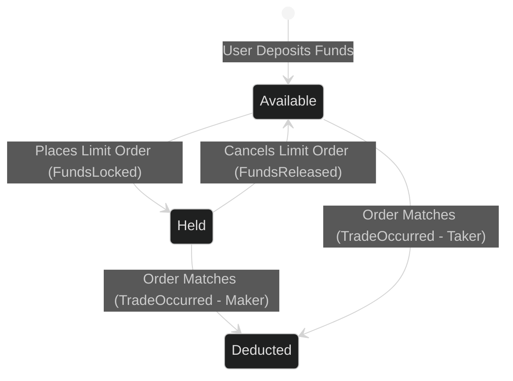

In [Part 3](/post/pyvenue-part-3), we explored how the deterministic Matching Engine handles matching between trading counterparties. We established exactly how user Commands are parsed, validated, and transformed into historical Events.

But matching algorithmic orders is of little use if an exchange doesn't verify that the users actually possess the funds required to settle those trades. Before an order rests on the order book or executes a match, the engine must validate the user's balances.

## Available vs. Held Funds

When you deposit money into an exchange, those funds enter your **Available** balance. You can withdraw them, or you can use them to open new positions.

However, when you place an order onto the order book, you haven't bought or sold anything yet. The order is just resting in a queue. If an exchange didn't lock your funds, you could place a buy order for 1 BTC, withdraw all your money via a separate API call, and default when the trade actually occurs.

To prevent this, exchanges use **Held** (or Reserved) balances.

Here is how we track this state in memory using flat dictionaries:

```python
from collections import defaultdict

class EngineState:
    def __init__(self, base_asset: Asset, quote_asset: Asset):
        self.base_asset = base_asset
        self.quote_asset = quote_asset
        
        # Structure: (AccountId, Asset) -> Integer amount
        # Total Real Balance = Available + Held
        self.accounts: dict[tuple[AccountId, Asset], int] = defaultdict(int)        # Available
        self.accounts_held: dict[tuple[AccountId, Asset], int] = defaultdict(int)   # Held/Reserved
        self.orders: dict[OrderId, OrderRecord] = {}                                # Order statuses
```

When a user places an order that rests on the book, the engine atomically moves their funds from `accounts` (Available) into `accounts_held` (Reserved).



```python
    def _apply_funds_reserved(self, event: FundsReserved) -> None:
        """Atomically lock funds for a new resting order."""
        if self.accounts[(event.account_id, event.asset)] < event.amount.lots:
            raise ValueError(f"Insufficient funds for account {event.account_id!r}")
        
        # Atomically transfer balances laterally
        self.accounts[(event.account_id, event.asset)] -= event.amount.lots
        self.accounts_held[(event.account_id, event.asset)] += event.amount.lots
```

## A Line-by-Line Ledger Scenario: Alice and Bob

To understand how an exchange manages money, let's trace a step-by-step scenario line by line.

**Initial Market State**: 
- We are operating the `BTC-USD` Engine.
- Alice deposits $100,000 USD.
- Bob deposits 10 BTC.

| Account | Asset | Available | Held |
| :--- | :--- | :--- | :--- |
| `Alice` | USD | 100,000 | 0 |
| `Bob` | BTC | 10 | 0 |

**Action 1**: Alice places a Limit BID to buy 1 BTC at $60,000.
The engine calculates the Notional Value (`1 * 60,000 = 60,000 USD`). Since Alice is buying, she must pay in the Quote Asset (USD). The engine generates a `FundsReserved` event for 60,000 USD.

| Account | Asset | Available | Held |
| :--- | :--- | :--- | :--- |
| `Alice` | USD | 40,000 | 60,000 |
| `Bob` | BTC | 10 | 0 |

**Action 2**: Bob wants to sell 1 BTC. He places a Market ASK for 1 BTC.
Bob's Market order checks the book, finds Alice's resting order, and matches against it at $60,000. 

Because Bob is the Taker in this match, his funds were never held; they are deducted instantly from his Available balance. Because Alice is the resting Maker, her funds are deducted from her Held balance.

Let's look at the result after the trade settles:

| Account | Asset | Available | Held |
| :--- | :--- | :--- | :--- |
| `Alice` | USD | 40,000 | 0 |
| `Alice` | BTC | 1 | 0 |
| `Bob` | BTC | 9 | 0 |
| `Bob` | USD | 60,000 | 0 |

Alice traded her 60,000 locked USD for 1 available BTC. Bob traded 1 available BTC for 60,000 available USD. The system stays balanced. Every amount is accounted for.

## Maker vs. Taker Ledger Updates in Python

Exchanges settle these two perspectives at the same time using a compact form of double-entry bookkeeping.

In every trade, there are two participants:
1.  **The Maker**: The user whose order was already resting on the order book. Their funds were locked in `accounts_held`.
2.  **The Taker**: The user whose incoming aggressive order immediately matched against the Maker. Their funds remain in their `accounts` (Available) balance.

```python
    def _apply_trade_occurred(self, event: TradeOccurred) -> None:
        """Settle a trade between two counterparties."""
        total_price = event.qty.lots * event.price.ticks

        # We execute this logic *twice*, once from the Maker's perspective, 
        # and once symmetrically from the Taker's perspective.
        
        # Determine direction based on the resting order
        if record.side == Side.BUY:
            pay_asset, get_asset = self.quote_asset, self.base_asset
            pay_qty, get_qty = total_price, event.qty.lots
        else:
            pay_asset, get_asset = self.base_asset, self.quote_asset
            pay_qty, get_qty = event.qty.lots, total_price
        
        # Everyone always receives what they bought into their available balance
        self.accounts[(record.account_id, get_asset)] += get_qty
        
        # Takers pay immediately from available, makers pay from reserved
        if is_maker:
            self.accounts_held[(record.account_id, pay_asset)] -= pay_qty
        else:
            self.accounts[(record.account_id, pay_asset)] -= pay_qty
```

Notice how we collapse the 4 directional cases (Maker Buy, Maker Sell, Taker Buy, Taker Sell) into a simple 12-line formula. By resolving `pay_asset` and `get_asset` algebraically, the single-threaded engine can process large volumes of trades quickly without deeply nested if/else branches!

## The Business of Trading: Maker and Taker Fees

Running a global exchange infrastructure is expensive. Exchanges monetize trading activity by charging small fees on executed matches. 

The industry standard fee structure is:
*   **Maker Fee**: Often lower (or even 0%) to incentivize users to provide liquidity. 
*   **Taker Fee**: Often higher, charging users for removing liquidity from the venue.

In practice, many modern crypto exchanges charge trading fees denominated in the **Quote Asset** (e.g., USD), regardless of whether the user is buying or selling the Base Asset (BTC). 

For example, if the venue fee is `0.10%` (10 basis points), and Bob is the taker selling 1 BTC for $60,000, his gross payout is $60,000.  The system calculates his fee: `60,000 * 0.001 = $60 USD`.
The resulting ledger update gives Bob `$59,940`, and transfers the remaining `$60` automatically into the Exchange's `Fee Account`.

### Fractional Dust and Rounding Errors

Applying a percentage-based decimal fee to discrete integer `Ticks` creates rounding issues. 

If Bob's final calculated fee is `$60.005`, we cannot transfer half a tick. The exchange must define a deterministic rounding policy (usually `ROUND_DOWN` or `ROUND_HALF_UP`) during integer fee conversion. Any remaining fractional remainder (known as "dust") is discarded *before* applying the ledger update, ensuring the system never accidentally creates or destroys base integer funds. 

## Race Conditions and Sequential Execution

By managing money within the core process using pure memory (`EngineState`), we avoid traditional SQL database transaction locking overhead. 

However, this design requires single-threaded execution inside the component. If we allowed two separate user threads to validate `self.accounts` and deduct from Alice at the same time, a classic race condition could occur, causing Alice to spend the same \$100 balance twice!

This is why the `Engine` consumes `Commands` in order from an atomic Queue.

In the final [Part 5](/post/pyvenue-part-5), we will explore how this boundary between incoming "Commands" and settled "Events" enables state reconstruction and replay: **Event Sourcing**.


--- 

Full code can be found under: 
https://github.com/cutamar/pyvenue/