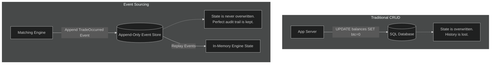

In the previous parts, we explored how a Matching Engine safely receives external **Commands** (like "buy 10 BTC"), validates them synchronously against the Order Book and the user's Ledger Balance, and produces immutable **Events** (like "10 BTC Trade Occurred").

But why go through the engineering effort of isolating 'Commands' from 'Events'? Why not update the SQL database row directly when an order matches, like a standard CRUD (Create, Read, Update, Delete) web application?

High-performance, fault-tolerant quantitative finance requires **Determinism**. 

## What is Determinism?

A deterministic software system is one where, given an ordered, identical sequence of initial inputs (Events), the system will always arrive at the exact same final State.

If a primary trading server crashes in the middle of a heavy trading day surge, you cannot risk restoring a standard SQL database backup, only to find partial trades, incomplete ledger updates, and severed API connections sitting in an unknown, tangled relational state. 

Instead, modern financial exchanges use an approach known as **Event Sourcing**.

## The Architecture of Event Sourcing

In a traditional CRUD architecture, the database stores the "current state" (e.g., "Alice currently has 5 BTC"). If Alice trades those 5 BTC away, the application overwrites the `BTC` column value internally in the `USERS` SQL table from `5` to `0`. The history is lost unless manually logged.

In **Event Sourcing**, the primary database does not store the current state at all. Instead, the database only stores an append-only log of immutable Events.

1.  `[Event Sequence 1]` Alice deposited 10 BTC.
2.  `[Event Sequence 2]` Alice traded 5 BTC away to Bob.

To determine Alice's current balance, the system starts from an empty state and replays the log step by step from the beginning. 



By separating the business logic inside `engine.state.apply()` away from database networking or validation, the state reconstruction path can run very quickly. We can reconstruct the full financial state from zero, processing hundreds of thousands of events per second.

```python
class Engine:
    @classmethod
    def replay(
        cls,
        instrument: Instrument,
        events: list[Event],
        next_meta: Callable[[], tuple[int, int]],
        rebuild_book: bool = False,
    ) -> Engine:
        # 1. Instantiate a blank Engine
        engine = cls(instrument=instrument, next_meta=next_meta)
        
        # 2. Feed the historical log into the apply path
        for e in events:
            if e.instrument == instrument:
                engine.log.append(e)
                
                # Settle the financial ledger
                engine.state.apply(e)
                
                # Optionally reconstruct the Limit Order Book queues
                if rebuild_book:
                    engine.book.apply_event(e)
                    
        return engine
```

## The Event Log Format

Because these serial events represent the Source of Truth for the entire business, serialization speed, compactness, and readability are critical.

We persist this immutable history into plain-text `.jsonl` files (JSON Lines format). Each event is written to its own line.

```json
{"event": "FundsReserved", "seq": 1, "ts_ns": 1715000000000, "instrument": "BTC-USD", "account_id": "alice", "asset": "USD", "amount": {"lots": 60000}}
{"event": "OrderRested", "seq": 2, "ts_ns": 1715000000001, "instrument": "BTC-USD", "account_id": "alice", "order_id": "order_1", "side": "BUY", "price": {"ticks": 60000}, "qty": {"lots": 1}}
{"event": "TradeOccurred", "seq": 3, "ts_ns": 1715000000002, "instrument": "BTC-USD", "taker_order_id": "order_2", "maker_order_id": "order_1", "qty": {"lots": 1}, "price": {"ticks": 60000}}
```

The matching engine simply reads the input stream in order:
1.  Instantiates a blank Python `Engine` object memory space.
2.  Parses the `.jsonl` text lines into typed Python `dataclass` events using the `JsonlEventStore`.
3.  Pushes each event directly into `apply()`.

If an auditor demands to know why Alice was charged $60,000 at exactly 9:02 AM, the log clearly describes the intent, the match, and the state transition in human-readable text.

## Idempotency and Sequence Identifiers

In distributed systems, networks drop connections and clients retry HTTP requests. This leads to a basic problem: what if the user clicks "Buy 1 BTC" twice? 

To solve this, Event Sourcing relies on **Idempotency**. An operation is idempotent if executing it multiple times yields the same result as executing it once.

We achieve this by assigning unique identifiers to every Command (`client_order_id`). If the API gateway receives a `PlaceLimit` command where the `order_id` is already already recorded inside `Engine.orders`, the engine immediately drops it and returns the cached execution result.

Furthermore, every persisted `Event` receives a strictly increasing `sequence_number` (`seq`). When replaying data, the engine rejects any event where the `seq` is less than or equal to the current internal high-water mark, protecting ordering even in the presence of corrupt or duplicated log data.

## The Snapshot Store

Replaying events from zero is fast, but after a year of trading, a market like BTC-USD might generate 10 billion events. Replaying 10 billion events every single time the process restarts would result in long outage windows, potentially taking hours to boot.

The solution is **Snapshotting**.

A snapshot is a periodic serialization of the `Engine`'s current in-memory state dictionary (Accounts, Held Balances, Orders, Order Book Data) written to disk at a specific boundary sequence number.

1.  The Engine runs for 1 million sequences.
2.  At sequence `1,000,000`, the engine pauses briefly and dumps its current in-memory state into a binary `snapshot_1000000.json` file.
3.  The engine resumes processing events.

If the engine crashes at sequence `1,050,000`, the recovery process is straightforward:
1.  Load the latest snapshot: `snapshot_1000000.json`. (This takes milliseconds).
2.  Set the engine's internal sequence tracker to `1,000,000`.
3.  Open the JSONL event log, skip everything before line `1,000,001`.
4.  Replay only the final `50,000` events.

Snapshotting provides the practical compromise between the auditability of Event Sourcing and the instant boot times of a CRUD database. 

## Schema Evolution and Upgrades

One of the harder challenges in maintaining a long-running Event Sourced system is handling data structure evolution. Over time, business requirements change. Perhaps regulators require that all `TradeOccurred` events include a new required field, such as a `routing_broker_id`. 

How do you add a new field to a Python `dataclass` when your historical `.jsonl` log file contains 10 million older events that do not contain this new field? If you simply add the field to the class, parsing the historical JSON during a replay will fail with a `TypeError: missing required positional argument`.

There are two main strategies to gracefully handle schema evolution:

1.  **Upcasting (On-the-fly Migration)**: Instead of modifying the historical log files on disk, you intercept the JSON payload during the read phase. Before the raw JSON dictionary is mapped into the `Event` dataclass, a mapping function inspects the `version` of the event. If it detects a legacy v1 event, it injects a default `routing_broker_id = None` into the payload before passing it to the dataclass constructor. This keeps historical files pristine and immutable.
2.  **Snapshot Translations**: Alternatively, when breaking changes are too large for simple upcasting, engineers rely on the Snapshot process. You can deploy the new code version, pause the engine, load the legacy `snapshot.json`, migrate the entire in-memory state into the new format, and then save a new `snapshot_v2.json`. The exchange can then resume from the new snapshot without ever needing to parse the deprecated legacy `.jsonl` structures again.

## Summary

By separating domain modeling (`ticks`/`lots`), active validation logic (`Engine.handle`), and deterministic state folding (`State.apply`), we have built a solid matching engine architecture in Python.

Event Sourcing eliminates database read/write locks from the hot path during concurrent trading execution and allows for strong resilience. When paired with periodic snapshotting and upcasting, the engine can scale horizontally and maintain sub-millisecond median latencies. 

This concludes our 5-part guide on building a high-performance matching venue. We have covered data primitives, price-time priority queues, order routing flow, maker/taker fee ledgers, and append-only persistence. You are now equipped with the architectural understanding to build exchange infrastructure!

--- 

Full code can be found under: 
https://github.com/cutamar/pyvenue/